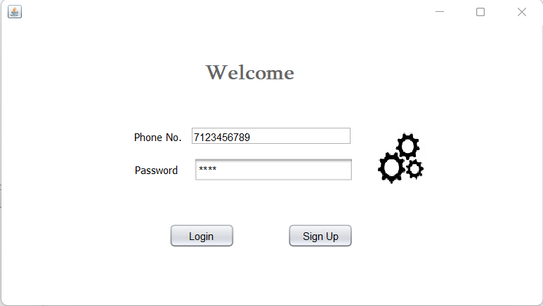
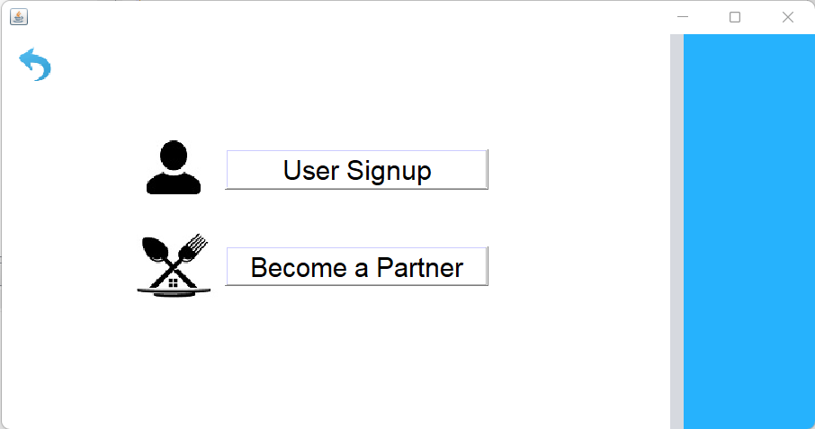
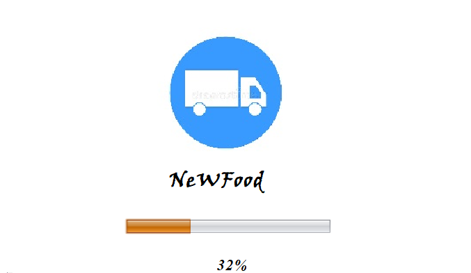
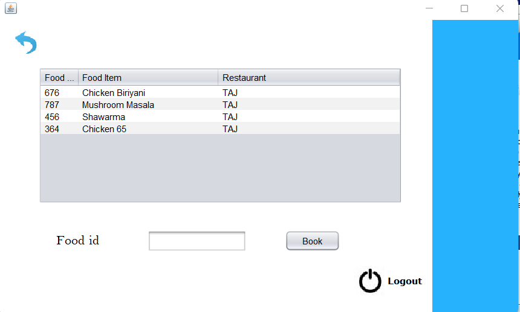

# NeWFood

## View our presentation at : [Presentation](https://prezi.com/view/2Oamlxai5faiFBw7qj63/)


<div id="top"></div>
<!--
*** Thanks for checking out the Best-README-Template. If you have a suggestion
*** that would make this better, please fork the repo and create a pull request
*** or simply open an issue with the tag "enhancement".
*** Don't forget to give the project a star!
*** Thanks again! Now go create something AMAZING! :D
-->


<!-- TABLE OF CONTENTS -->
<details>
  <summary>Table of Contents</summary>
  <ol>
    <li>
      <a href="#about-the-project">NeWFood</a>
      <ul>
        <li><a href="#built-with">Built With</a></li>
      </ul>
    </li>
    <li>
      <a href="#getting-started">Getting Started</a>
      <ul>
        <li><a href="#prerequisites">Prerequisites</a></li>
        <li><a href="#installation">Installation</a></li>
      </ul>
    </li>
    <li><a href="#usage">Usage</a></li>
    <li><a href="#contributing">Contributing</a></li>
    <li><a href="#contact">Contact</a></li>
  </ol>
</details>

<!--MEMBERS-->
# Members 

### [Muhammad](https://github.com/Muhammedcv50)</br>
### [Hanin Moideen](https://github.com/hmp-36)</br>
### [Sreejith A](https://github.com/sreejith19)</br>
### [Bhagyasree V S](https://github.com/bhagyavs)</br>
### [Jubin Biju Koruthu](https://github.com/jubinbiju)</br>
### [Sujith V I](https://github.com/VI-Suji)


<!-- ABOUT THE PROJECT -->
## About The Project

<div align="center">
  <a href="https://github.com/VI-Suji/NeWFood">
    
  </a>
</div>

The project mainly deals with the wastage of food made purely from scratch using java and swing. This will allow everyone to use the leftover food which reduces the food wastage as well as it provide the restaurants to be neat and be sure not providing bad food items

Here's why:
* As per the analysis daily watsage of food is increases day by day
* Majority of the night travellers as well as the hostellers feels to eat food but there is no option
* Improve the efficiency of any food serving app with the latest algorithm with the sustainable goals :smile:


<p align="right">(<a href="#top">back to top</a>)</p>


### Built With

Major frameworks/libraries used to bootstrap your project.

* [Java](https://java.com/en/)
* [Swing](https://en.wikipedia.org/wiki/Swing_(Java))
* [IBM DB2](https://cloud.ibm.com/catalog/services/db2)

<p align="right">(<a href="#top">back to top</a>)</p>


<!-- GETTING STARTED -->
## Getting Started

Instructions on setting up your project locally.
To get a local copy up and running follow these simple example steps.

### Prerequisites

This is an example of how to list things you need to use the software and how to install them.
* java
  ```sh
  apt-get install java
  ```

### Installation

_Look for what you can do on the project after doing the following steps_


1. Clone the repo
   ```sh
   git clone https://github.com/VI-Suji/NeWFood.git
   ```
2. Use Netbeans IDE packages

3. Run the project
<p align="right">(<a href="#top">back to top</a>)</p>


<!-- USAGE EXAMPLES -->
## Usage

Screenshots

<div align="center">
  <a href="https://github.com/VI-Suji/NeWFood">
    
  </a>
   <a href="https://github.com/VI-Suji/NeWFood">
    
  </a>
   <a href="https://github.com/VI-Suji/NeWFood">
    
  </a>
</div>

<p align="right">(<a href="#top">back to top</a>)</p>


<!-- CONTRIBUTING -->
## Contributing

Contributions are what make the open source community such an amazing place to learn, inspire, and create. Any contributions you make are **greatly appreciated**.

If you have a suggestion that would make this better, please fork the repo and create a pull request. You can also simply open an issue with the tag "enhancement".
Don't forget to give the project a star! Thanks again!


<!-- CONTACT -->
## Contact

Project Link: [https://github.com/VI-Suji/NeWFood](https://github.com/Vi-Suji/NeWFood)

<p align="right">(<a href="#top">back to top</a>)</p>
